# Database Schema — LOKMIT FOUNDATION

Reference documentation for the PostgreSQL schema managed by Flyway
(`backend/src/main/resources/db/migration`). The database is the single source
of structural truth for the MVP; JPA entities (introduced from the
authentication phase onward) must match it.

## Overview

| Migration | Domain | Tables |
|---|---|---|
| `V1__baseline.sql` | Baseline probe (no structure) | — |
| `V2__identity_schema.sql` | Identity + seed data | `users`, `roles`, `permissions`, `role_permissions`, `user_roles`, `refresh_tokens` |
| `V3__corporate_cms_schema.sql` | Corporate / CMS | `site_settings`, `website_content`, `seo_metadata`, `team_members`, `certifications`, `partners`, `downloads`, `faqs` |
| `V4__services_catalog_schema.sql` | Services catalog | `service_categories`, `services`, `expertise_areas` |
| `V5__projects_schema.sql` | Projects | `project_categories`, `projects`, `project_images` |
| `V6__content_schema.sql` | News/blog, events, gallery | `news_categories`, `blog_posts`, `blog_post_categories`, `events`, `event_images`, `galleries`, `gallery_categories`, `gallery_items`, `testimonials` |
| `V7__communication_schema.sql` | Communication | `contact_messages` |
| `V8__employment_schema.sql` | Employment / job portal | `employers`, `candidates`, `resumes`, `skills`, `candidate_skills`, `candidate_educations`, `candidate_experiences`, `job_categories`, `jobs`, `job_skills`, `job_applications` |
| `V9__login_protection.sql` | Login brute-force protection | adds `failed_login_attempts`, `failed_login_window_started_at`, `locked_until` to `users` |
| `V10__refresh_token_hardening.sql` | Refresh-token hardening | adds `family_id`, `consumed_at` to `refresh_tokens` (rotation reuse detection + atomic consumption) |
| `V11__dashboard_permission.sql` | Admin dashboard access | adds `dashboard:view` permission granted to SUPER_ADMIN and ADMIN (A2) |
| `V12__services_permission.sql` | Admin services & expertise management | adds `services:manage` permission granted to SUPER_ADMIN and ADMIN (A5) |
| `V13__projects_permission.sql` | Admin projects management | adds `projects:manage` permission granted to SUPER_ADMIN and ADMIN (A6) |
| `V14__employment_permissions.sql` | Admin employment foundation | adds `employment:manage` and `candidates:manage` permissions granted to SUPER_ADMIN and ADMIN (A7.1) |
| `V15__application_history_interviews.sql` | Application history + interviews | `application_status_history`, `interviews` (A7.4) |
| `V16__notifications_audit_outbox.sql` | Notifications + audit + outbox | `notifications`, `audit_logs`, `outbox_events` + `notifications:manage` permission (A7.5) |
| — | Admin user management | no new migration: the existing `users:manage` permission (V2, SUPER_ADMIN) guards `/api/v1/admin/users`; role/status data comes from the existing identity tables (A3) |
| — | Admin CMS management | no new migration: existing V2 permissions guard `/api/v1/admin/cms` (`settings:manage` → site settings; `content:manage` → website content/SEO reads & edits; `content:publish` → content lifecycle & deletion); data comes from the V3 `site_settings`, `website_content`, `seo_metadata` tables (A4) |
| — | Admin employment foundation | V14 adds `employment:manage` and `candidates:manage` (both granted to SUPER_ADMIN and ADMIN) guarding `/api/v1/admin/employers|candidates|skills|job-categories` and the nested candidate-skill assignments; no new tables — data comes from the V8 employment tables (A7.1) |
| — | Admin job management | no new migration: the existing `employment:manage` permission (V14, SUPER_ADMIN and ADMIN) guards `/api/v1/admin/jobs` CRUD + publish/close/archive lifecycle and the nested job-skill requirements; no new tables — data comes from the V8 `jobs` and `job_skills` tables (A7.2) |
| — | Admin application management | no new migration: the existing `employment:manage` permission (V14, SUPER_ADMIN and ADMIN) guards `/api/v1/admin/applications` review lifecycle (start-review/shortlist/decide/withdraw) + note/resume-reference patch; no new tables — data comes from the V8 `job_applications` table (A7.3) |
| — | Admin application history + interviews | V15 adds `application_status_history` (automatic audit of lifecycle transitions, written in the same transaction as the status change) and `interviews` (scheduling records per application); the existing `employment:manage` permission (V14) guards the read/write endpoints (A7.4) |
| — | Admin notifications + audit + outbox | V16 adds `notifications` (personal in-app notices, recipient-scoped, `notifications:manage` granted to SUPER_ADMIN + ADMIN), `audit_logs` (append-only administrative trail written by backend services, reads SUPER_ADMIN-only via `users:manage`) and `outbox_events` (transactional outbox relayed into in-app notifications; no public API) (A7.5) |

46 domain tables + `flyway_schema_history` (managed by Flyway itself).

Payments/donations tables are **deferred** (Phase 0 decision) and are not part
of this schema.

## Naming Conventions

- **Tables:** plural, `snake_case` (`users`, `job_applications`).
- **Columns:** `snake_case`.
- **Primary key:** `id BIGINT GENERATED ALWAYS AS IDENTITY PRIMARY KEY`.
- **Foreign key columns:** `<referenced_entity_singular>_id` (`user_id`,
  `project_id`).
- **Unique constraints:** `uq_<table>_<purpose>`
  (`uq_users_email`, `uq_website_content_page_section`).
- **Check constraints:** `chk_<table>_<purpose>`
  (`chk_jobs_status`, `chk_projects_dates`).
- **Foreign keys:** `fk_<table>_<referenced>` (`fk_jobs_employer`).
- **Indexes:** `idx_<table>_<purpose>` (`idx_jobs_employer`,
  `idx_projects_status_published`).
- **Timestamps:** `TIMESTAMPTZ`; `created_at`/`updated_at` `NOT NULL DEFAULT now()`.
- Constraint names follow these patterns explicitly (no PostgreSQL auto-generated
  names) so that later migrations can alter them deterministically.

## Design Decisions

| # | Decision | Rationale |
|---|---|---|
| D1 | Enum-like values stored as `VARCHAR` + `CHECK` constraints (not native PostgreSQL enums) | New enum values require only `ALTER TABLE ... DROP/ADD CONSTRAINT` — no type surgery; Flyway-friendly and portable |
| D2 | `created_at`/`updated_at` `TIMESTAMPTZ NOT NULL DEFAULT now()` on every domain table | Deterministic audit baseline; JPA auditing (`@CreatedDate`/`@LastModifiedDate`) takes over from the auth phase |
| D3 | Candidate+CandidateProfile merged into `candidates`; Employer+EmployerProfile merged into `employers` | The 1:1 split added no value at MVP scale; one row per platform identity is simpler to query and maintain |
| D4 | Lifecycle status columns (`DRAFT`/`PUBLISHED`/`ARCHIVED`) instead of soft-delete `deleted_at` columns on content tables | Editorial workflow states are the real requirement; hard delete is acceptable for MVP content |
| D5 | `seo_metadata` is a polymorphic companion table (`entity_type`, `entity_id`) with **no foreign key** | Keeps SEO columns out of every content table; orphan cleanup is an application responsibility — accepted MVP trade-off |
| D6 | FAQ and Download categories are lightweight `VARCHAR` columns, not dictionary tables | Category vocabularies there are small and informal; promoting to dictionary tables later is a non-breaking migration |
| D7 | Bootstrap admin user seeded with `password_hash NULL` | No known credentials ship in code; the authentication phase sets the initial admin password from environment configuration |
| D8 | Projects have a single `category_id` (many-to-one) | One category covers the MVP portfolio; many-to-many can be added later without breaking the column |
| D9 | `jobs.slug` is globally unique (not employer-scoped) | Enables clean `/jobs/{slug}` URLs without employer context; application-level slug generation ensures uniqueness |
| D10 | Deletion rules: `CASCADE` for owned children (images, resumes, tokens, joins), default `RESTRICT` for referenced-by records (`jobs.employer_id`, `job_applications.job_id/candidate_id`) | Prevents accidental loss of application history; user deletion flows must clean dependents explicitly |
| D11 | `users.password_hash` is `NULL`-able | Supports the seeded bootstrap admin (D7) and future OAuth-only accounts; `NULL` = no local credential |

## Employment Domain Notes

- `employers.verification_status` gates job publishing at the application layer
  (Phase 15/16 concern, not a DB constraint).
- `resumes` has a **partial unique index** (`uq_resumes_one_active_per_candidate`)
  enforcing one active resume per candidate — PostgreSQL-specific and intentional.
- `job_applications` enforces **one application per job per candidate**
  (`uq_job_applications_job_candidate`) and snapshots the applied resume via
  `resume_id` (FK `ON DELETE SET NULL`).

## Verification

`FlywayMigrationIntegrationTest` (test profile, skipped automatically when
PostgreSQL is unreachable) applies the full migration chain to a throwaway
schema `lokmit_it`, asserts all 43 domain tables exist (44 including
`flyway_schema_history`), asserts history rows `V1..V15` succeeded, and
verifies a second migrate run is a no-op.

## Authentication Schema (Phase 4)

The identity schema (`V2__identity_schema.sql`) is used for authentication:

- **users** - Stores user accounts with BCrypt-hashed passwords. The bootstrap
  admin ships with `password_hash NULL` until Phase 4 provisions a credential.
- **roles** - Role definitions (SUPER_ADMIN, ADMIN, EDITOR, MODERATOR, etc.)
- **permissions** - Granular permissions (content:manage, users:manage, etc.)
- **role_permissions** - Many-to-many join between roles and permissions
- **user_roles** - Many-to-many join between users and roles
- **refresh_tokens** - Stores SHA-256 hashes of refresh tokens (never the raw token)

Security features:
- Passwords are hashed with BCrypt (never stored in plaintext)
- Refresh tokens are hashed with SHA-256 before storage
- Only token hashes are stored in the database
- User status (ACTIVE/LOCKED/SUSPENDED/DELETED) controls authentication

## ER Diagram

```mermaid
erDiagram
    USERS ||--o| CANDIDATES : "1:1 profile"
    USERS ||--o| EMPLOYERS : "1:1 profile"
    USERS ||--o{ REFRESH_TOKENS : "issues"
    USERS ||--o{ USER_ROLES : "has"
    USERS ||--o{ BLOG_POSTS : "authors (nullable)"

    ROLES ||--o{ USER_ROLES : "assigned via"
    ROLES ||--o{ ROLE_PERMISSIONS : "grants"
    PERMISSIONS ||--o{ ROLE_PERMISSIONS : "granted via"

    EMPLOYERS ||--o{ JOBS : "posts"
    CANDIDATES ||--o{ RESUMES : "uploads"
    CANDIDATES ||--o{ CANDIDATE_SKILLS : "has"
    CANDIDATES ||--o{ CANDIDATE_EDUCATIONS : "has"
    CANDIDATES ||--o{ CANDIDATE_EXPERIENCES : "has"
    CANDIDATES ||--o{ JOB_APPLICATIONS : "submits"
    SKILLS ||--o{ CANDIDATE_SKILLS : "tagged via"
    SKILLS ||--o{ JOB_SKILLS : "required via"
    JOB_CATEGORIES ||--o{ JOBS : "categorizes"
    JOBS ||--o{ JOB_SKILLS : "requires"
    JOBS ||--o{ JOB_APPLICATIONS : "receives"
    RESUMES |o--o| JOB_APPLICATIONS : "attached to (snapshot)"
    JOB_APPLICATIONS ||--o{ APPLICATION_STATUS_HISTORY : "records"
    JOB_APPLICATIONS ||--o{ INTERVIEWS : "schedules"
    USERS |o--o{ APPLICATION_STATUS_HISTORY : "changed by"

    SERVICE_CATEGORIES ||--o{ SERVICES : "categorizes"

    PROJECT_CATEGORIES ||--o{ PROJECTS : "categorizes"
    PROJECTS ||--o{ PROJECT_IMAGES : "contains"

    NEWS_CATEGORIES ||--o{ BLOG_POST_CATEGORIES : "classifies"
    BLOG_POSTS ||--o{ BLOG_POST_CATEGORIES : "classified via"

    EVENTS ||--o{ EVENT_IMAGES : "contains"

    GALLERY_CATEGORIES ||--o{ GALLERIES : "categorizes"
    GALLERIES ||--o{ GALLERY_ITEMS : "contains"

    SEO_METADATA }o..o| BLOG_POSTS : "describes (polymorphic)"
    SEO_METADATA }o..o| PROJECTS : "describes (polymorphic)"
    SEO_METADATA }o..o| EVENTS : "describes (polymorphic)"
```

Join tables (`user_roles`, `role_permissions`, `blog_post_categories`,
`candidate_skills`, `job_skills`) use composite primary keys.
`contact_messages`, `site_settings`, `website_content`, `seo_metadata`,
`team_members`, `certifications`, `partners`, `downloads`, `faqs`,
`testimonials` are standalone tables with no foreign keys.

### V8 employment delete semantics (admin API A7.1)

- `fk_employers_user` / `fk_candidates_user` are `ON DELETE CASCADE` into
  `users` — deleting an employer/candidate profile would delete the owning
  user identity (and transitively `user_roles`, `refresh_tokens`, etc.).
  The admin API therefore does NOT expose hard-delete endpoints for these
  profiles; lifecycle is managed via status fields instead.
- `fk_candidate_skills_skill` / `fk_job_skills_skill` are
  `ON DELETE CASCADE` — deleting a skill removes its candidate assignments
  and job requirements (intentional, documented cleanup).
- `fk_jobs_category` is `ON DELETE SET NULL` — deleting a job category
  detaches jobs, never deletes them.
- `fk_jobs_employer` has NO ON DELETE action — the database refuses to
  delete an employer while jobs reference it.
- `fk_job_skills_job` is `ON DELETE CASCADE` — deleting a job removes its
  skill requirements (A7.2 job DELETE relies on this).
- `fk_job_applications_job` has NO ON DELETE action — the database refuses
  to delete a job that already has applications. Job deletion is therefore
  effectively blocked once applications exist; the archive lifecycle is the
  supported retirement path. Application management itself is A7.3.
- `fk_job_applications_resume` is `ON DELETE SET NULL` — removing a resume
  detaches the application's resume reference, never deletes the
  application.
- A7.3 exposes NO application delete endpoint: applications are the hiring
  audit trail, and WITHDRAWN/REJECTED lifecycle is the supported retirement
  path.

### V15 application history + interviews delete semantics (admin API A7.4)

- `fk_application_status_history_application` is `ON DELETE CASCADE` —
  history rows are owned by their application and are meaningless without
  it (same ownership-cleanup semantics as V8's `fk_job_skills_job`). A7.3
  exposes no application-delete endpoint, so in practice rows only disappear
  alongside their (FK-blocked) application.
- `fk_interviews_application` is `ON DELETE CASCADE` for the same reason —
  deleting an interview can never delete the application (the ownership
  direction is application → interviews).
- `fk_application_status_history_actor` (`changed_by` → `users.id`) has
  **NO ON DELETE action** and is NULLable: audit survival is never coupled to
  user retention, and the database refuses to delete a user that authored
  history rows. The actor id is written by the backend from the
  authenticated principal (`SecurityUtils`); it is never client-supplied.
- Status integrity: `chk_application_status_history_new`/
  `chk_application_status_history_previous` restrict values to the six V8
  application statuses; `chk_application_status_history_transition` requires
  `previous_status IS DISTINCT FROM new_status`. Interview mode/status are
  constrained by `chk_interviews_mode` (ONSITE/REMOTE/PHONE) and
  `chk_interviews_status` (SCHEDULED/COMPLETED/CANCELLED/NO_SHOW).
- Indexes: `idx_application_status_history_application (application_id,
  changed_at DESC)` and `idx_interviews_application (application_id,
  scheduled_at)` back the paginated list endpoints.

## A7.5 — Notifications, Audit Logs & Transactional Outbox (V16)

V16 adds three tables plus one permission seed (`notifications:manage`,
granted to SUPER_ADMIN and ADMIN):

### notifications

Personal in-app notices addressed to ONE user. MVP delivery is IN-APP ONLY
— no delivery-channel columns exist by design (email/SMS/WhatsApp are
explicitly out of scope for this phase).

- Columns: `recipient_user_id` (FK → `users.id`, **ON DELETE CASCADE** —
  personal data), `type` (`chk_notifications_type`:
  APPLICATION_STATUS_CHANGED / INTERVIEW_SCHEDULED / INTERVIEW_UPDATED /
  INTERVIEW_CANCELLED), `title`, `body`, `entity_type`, `entity_id`,
  `read_at` (NULL = unread), `created_at`.
- Indexes: `idx_notifications_recipient_read (recipient_user_id, read_at)`
  backs the unread count and recipient list; `idx_notifications_created
  (created_at DESC)` backs retention-style ordering.

### audit_logs

Append-only administrative action trail, backend-written only. There is
NO `updated_at` and no update/delete API — records are immutable.

- Columns: `actor_user_id` (FK → `users.id`, **NO ON DELETE action**,
  NULLable for system actions — same rationale as V15's history actor),
  `action`, `entity_type`, `entity_id`, `details` (validated, redacted JSON
  TEXT), `created_at`.
- Security: `details` never contains passwords, tokens, JWTs, secrets or
  credentials — the service redacts such keys before persistence and fails
  the transaction on unserializable payloads.
- Indexes: `idx_audit_logs_created (created_at DESC)`,
  `idx_audit_logs_entity (entity_type, entity_id)`,
  `idx_audit_logs_actor (actor_user_id)`.

### outbox_events

Transactional outbox. Business services persist an event row in the SAME
transaction as the originating action; a scheduled relay claims rows
atomically and materializes in-app notifications. No external delivery
occurs from the relay.

- Columns: `aggregate_type`, `aggregate_id` (**no FK** — aggregates span
  domains and must not create destructive coupling), `event_type`,
  `payload` (valid JSON **TEXT**, not JSONB — validated in application
  code), `status` (`chk_outbox_events_status`: PENDING / PROCESSED /
  FAILED, default PENDING), `attempts` (`chk_outbox_events_attempts`:
  >= 0), `available_at` (retry gate), `processed_at`, `created_at`.
- Multi-instance safety: the relay claims due rows with
  `FOR UPDATE SKIP LOCKED`; retries use `attempts` + `available_at` with
  bounded backoff; events past max attempts are marked FAILED (terminal).
- Index: `idx_outbox_events_status_available (status, available_at)` backs
  the claim query.

