# Database Schema — LOKMIT FOUNDATION

Reference documentation for the PostgreSQL schema managed by Flyway
(`backend/src/main/resources/db/migration`). The database is the single source
of structural truth for the MVP; JPA entities (introduced from the
authentication phase onward) must match it.

## Overview

| Migration | Domain | Tables |
|---|---|---|
| `V1__baseline.sql` | Baseline probe (no structure) | — |
| `V2__identity_schema.sql` | Identity + seed data | `users`, `roles`, `permissions`, `role_permissions`, `user_roles`, `refresh_tokens` |
| `V3__corporate_cms_schema.sql` | Corporate / CMS | `site_settings`, `website_content`, `seo_metadata`, `team_members`, `certifications`, `partners`, `downloads`, `faqs` |
| `V4__services_catalog_schema.sql` | Services catalog | `service_categories`, `services`, `expertise_areas` |
| `V5__projects_schema.sql` | Projects | `project_categories`, `projects`, `project_images` |
| `V6__content_schema.sql` | News/blog, events, gallery | `news_categories`, `blog_posts`, `blog_post_categories`, `events`, `event_images`, `galleries`, `gallery_categories`, `gallery_items`, `testimonials` |
| `V7__communication_schema.sql` | Communication | `contact_messages` |
| `V8__employment_schema.sql` | Employment / job portal | `employers`, `candidates`, `resumes`, `skills`, `candidate_skills`, `candidate_educations`, `candidate_experiences`, `job_categories`, `jobs`, `job_skills`, `job_applications` |

41 domain tables + `flyway_schema_history` (managed by Flyway itself).

Payments/donations tables are **deferred** (Phase 0 decision) and are not part
of this schema.

## Naming Conventions

- **Tables:** plural, `snake_case` (`users`, `job_applications`).
- **Columns:** `snake_case`.
- **Primary key:** `id BIGINT GENERATED ALWAYS AS IDENTITY PRIMARY KEY`.
- **Foreign key columns:** `<referenced_entity_singular>_id` (`user_id`,
  `project_id`).
- **Unique constraints:** `uq_<table>_<purpose>`
  (`uq_users_email`, `uq_website_content_page_section`).
- **Check constraints:** `chk_<table>_<purpose>`
  (`chk_jobs_status`, `chk_projects_dates`).
- **Foreign keys:** `fk_<table>_<referenced>` (`fk_jobs_employer`).
- **Indexes:** `idx_<table>_<purpose>` (`idx_jobs_employer`,
  `idx_projects_status_published`).
- **Timestamps:** `TIMESTAMPTZ`; `created_at`/`updated_at` `NOT NULL DEFAULT now()`.
- Constraint names follow these patterns explicitly (no PostgreSQL auto-generated
  names) so that later migrations can alter them deterministically.

## Design Decisions

| # | Decision | Rationale |
|---|---|---|
| D1 | Enum-like values stored as `VARCHAR` + `CHECK` constraints (not native PostgreSQL enums) | New enum values require only `ALTER TABLE ... DROP/ADD CONSTRAINT` — no type surgery; Flyway-friendly and portable |
| D2 | `created_at`/`updated_at` `TIMESTAMPTZ NOT NULL DEFAULT now()` on every domain table | Deterministic audit baseline; JPA auditing (`@CreatedDate`/`@LastModifiedDate`) takes over from the auth phase |
| D3 | Candidate+CandidateProfile merged into `candidates`; Employer+EmployerProfile merged into `employers` | The 1:1 split added no value at MVP scale; one row per platform identity is simpler to query and maintain |
| D4 | Lifecycle status columns (`DRAFT`/`PUBLISHED`/`ARCHIVED`) instead of soft-delete `deleted_at` columns on content tables | Editorial workflow states are the real requirement; hard delete is acceptable for MVP content |
| D5 | `seo_metadata` is a polymorphic companion table (`entity_type`, `entity_id`) with **no foreign key** | Keeps SEO columns out of every content table; orphan cleanup is an application responsibility — accepted MVP trade-off |
| D6 | FAQ and Download categories are lightweight `VARCHAR` columns, not dictionary tables | Category vocabularies there are small and informal; promoting to dictionary tables later is a non-breaking migration |
| D7 | Bootstrap admin user seeded with `password_hash NULL` | No known credentials ship in code; the authentication phase sets the initial admin password from environment configuration |
| D8 | Projects have a single `category_id` (many-to-one) | One category covers the MVP portfolio; many-to-many can be added later without breaking the column |
| D9 | `jobs.slug` is globally unique (not employer-scoped) | Enables clean `/jobs/{slug}` URLs without employer context; application-level slug generation ensures uniqueness |
| D10 | Deletion rules: `CASCADE` for owned children (images, resumes, tokens, joins), default `RESTRICT` for referenced-by records (`jobs.employer_id`, `job_applications.job_id/candidate_id`) | Prevents accidental loss of application history; user deletion flows must clean dependents explicitly |
| D11 | `users.password_hash` is `NULL`-able | Supports the seeded bootstrap admin (D7) and future OAuth-only accounts; `NULL` = no local credential |

## Employment Domain Notes

- `employers.verification_status` gates job publishing at the application layer
  (Phase 15/16 concern, not a DB constraint).
- `resumes` has a **partial unique index** (`uq_resumes_one_active_per_candidate`)
  enforcing one active resume per candidate — PostgreSQL-specific and intentional.
- `job_applications` enforces **one application per job per candidate**
  (`uq_job_applications_job_candidate`) and snapshots the applied resume via
  `resume_id` (FK `ON DELETE SET NULL`).

## Verification

`FlywayMigrationIntegrationTest` (test profile, skipped automatically when
PostgreSQL is unreachable) applies the full migration chain to a throwaway
schema `lokmit_it`, asserts all 41 tables exist, asserts history rows
`V1..V8` succeeded, and verifies a second migrate run is a no-op.

## ER Diagram

```mermaid
erDiagram
    USERS ||--o| CANDIDATES : "1:1 profile"
    USERS ||--o| EMPLOYERS : "1:1 profile"
    USERS ||--o{ REFRESH_TOKENS : "issues"
    USERS ||--o{ USER_ROLES : "has"
    USERS ||--o{ BLOG_POSTS : "authors (nullable)"

    ROLES ||--o{ USER_ROLES : "assigned via"
    ROLES ||--o{ ROLE_PERMISSIONS : "grants"
    PERMISSIONS ||--o{ ROLE_PERMISSIONS : "granted via"

    EMPLOYERS ||--o{ JOBS : "posts"
    CANDIDATES ||--o{ RESUMES : "uploads"
    CANDIDATES ||--o{ CANDIDATE_SKILLS : "has"
    CANDIDATES ||--o{ CANDIDATE_EDUCATIONS : "has"
    CANDIDATES ||--o{ CANDIDATE_EXPERIENCES : "has"
    CANDIDATES ||--o{ JOB_APPLICATIONS : "submits"
    SKILLS ||--o{ CANDIDATE_SKILLS : "tagged via"
    SKILLS ||--o{ JOB_SKILLS : "required via"
    JOB_CATEGORIES ||--o{ JOBS : "categorizes"
    JOBS ||--o{ JOB_SKILLS : "requires"
    JOBS ||--o{ JOB_APPLICATIONS : "receives"
    RESUMES |o--o| JOB_APPLICATIONS : "attached to (snapshot)"

    SERVICE_CATEGORIES ||--o{ SERVICES : "categorizes"

    PROJECT_CATEGORIES ||--o{ PROJECTS : "categorizes"
    PROJECTS ||--o{ PROJECT_IMAGES : "contains"

    NEWS_CATEGORIES ||--o{ BLOG_POST_CATEGORIES : "classifies"
    BLOG_POSTS ||--o{ BLOG_POST_CATEGORIES : "classified via"

    EVENTS ||--o{ EVENT_IMAGES : "contains"

    GALLERY_CATEGORIES ||--o{ GALLERIES : "categorizes"
    GALLERIES ||--o{ GALLERY_ITEMS : "contains"

    SEO_METADATA }o..o| BLOG_POSTS : "describes (polymorphic)"
    SEO_METADATA }o..o| PROJECTS : "describes (polymorphic)"
    SEO_METADATA }o..o| EVENTS : "describes (polymorphic)"
```

Join tables (`user_roles`, `role_permissions`, `blog_post_categories`,
`candidate_skills`, `job_skills`) use composite primary keys.
`contact_messages`, `site_settings`, `website_content`, `seo_metadata`,
`team_members`, `certifications`, `partners`, `downloads`, `faqs`,
`testimonials` are standalone tables with no foreign keys.

